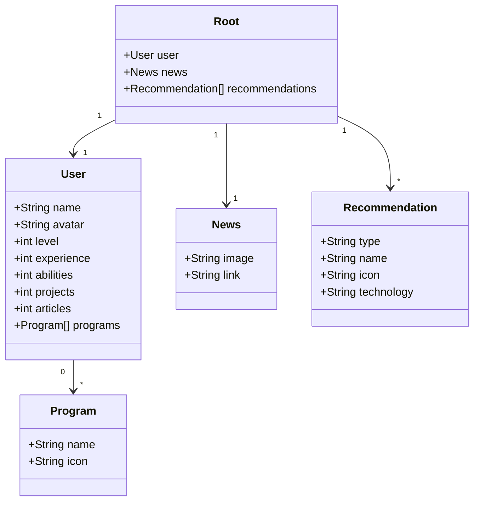

# Desafio Deal Java RESTful API com Spring Boot
Java RESTful API criada com Spring Boot.

## Diagrama de Classes

```mermaid
classDiagram
    class User {
        +String name
        +String avatar
        +int level
        +int experience
        +int abilities
        +int projects
        +int articles
        +Program[] programs
    }

    class Program {
        +String name
        +String icon
    }

    class News {
        +String image
        +String link
    }

    class Recommendation {
        +String type
        +String name
        +String icon
        +String technology
    }

    class Root {
        +User user
        +News news
        +Recommendation[] recommendations
    }

    Root "1" --> "1" User
    Root "1" --> "1" News
    Root "1" --> "*" Recommendation
    User "0" --> "*" Program
``` 
